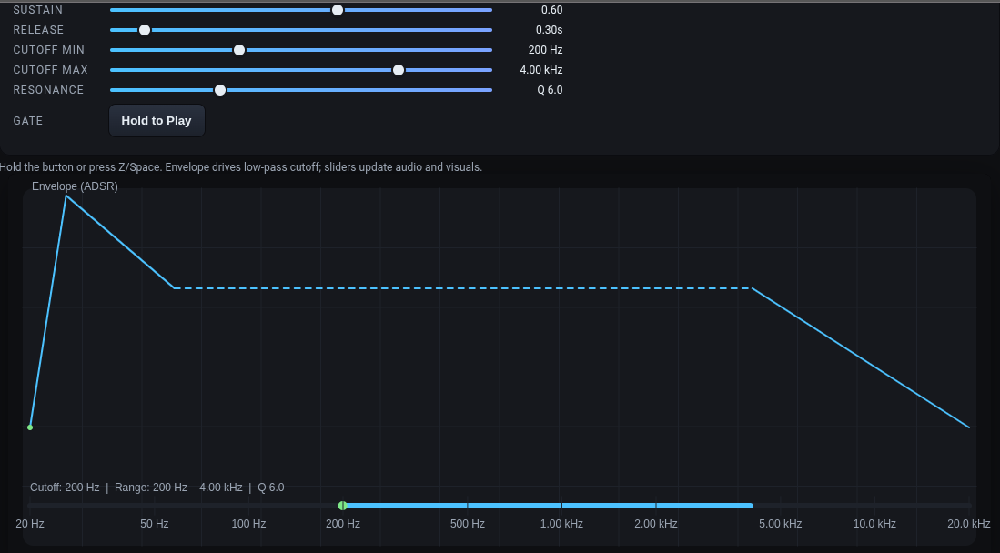

# EnvelopeGenWWW

The envelope is the underdog of the synth world.  
Find your own magic settings using this from any web browser.

Usage
1. Clone this repo (or download the zip file)
2. JustOpen `index.html` in a browser (no build step required).
3. Adjust the ADSR controls and trigger the envelope to hear the result, either click if you are on a cell phone, or space bar is easier on a desktop.
